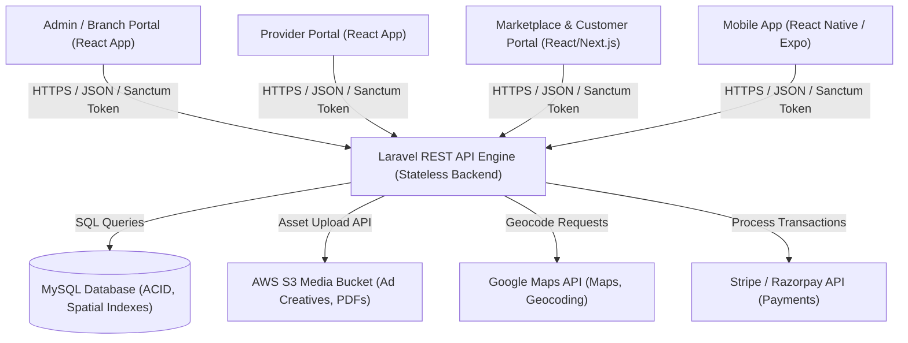

# 05. System Architecture

> **This document represents the finalized Version 1 architecture. Any new feature outside Version 1 must be documented under `12-future-roadmap.md` before implementation.**

## Purpose

The purpose of this document is to detail the logical and physical architecture of SODARS, showing how components communicate, isolate data, and authenticate clients.

---

## Scope

This document covers:
* The system architecture diagram (Mermaid).
* Client-server communication topology.
* Authentication and authorization topology.
* Data isolation strategy by regional branches.

---

## Business Rules

### 1. Architectural Topology

### 2. Communication Standards
* **Protocol**: HTTPS-only for all web clients. API payloads must follow standardized JSON formatting.
* **State Management**: Stateless API endpoints. Sessions are stored client-side using Web Tokens (Sanctum-managed bearer tokens).
* **Media Pipelines**: When uploading ad creatives:
  1. The client requests a pre-signed URL from the Laravel API.
  2. The client uploads the large video/image file directly to AWS S3 storage.
  3. The client submits a reference key back to the Laravel API to store in the database.
  *This prevents Laravel from blocking web workers during large video file transfers.*

### 3. Branch Data Isolation
* All digital screen assets, bookings, invoices, and branch managers are assigned a `branch_id`.
* Branch Managers can query only data matching their assigned `branch_id`.
* Super Admins (Head Office) bypass these restrictions and can run cross-branch aggregations.

---

## Future Scope

* **API Gateway / Proxy**: Introduction of a gateway proxy (like Kong or Nginx) to handle rate-limiting and route management as request volume grows.
* **Transcoding Worker**: Dedicated serverless node (AWS Lambda) to automatically transcode user-uploaded video creatives into player-supported resolutions and codecs.
