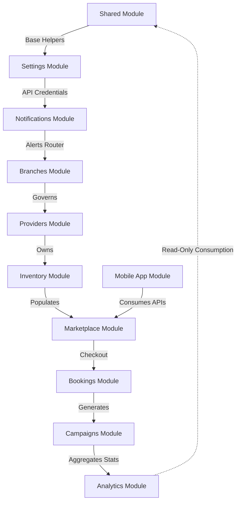

# SODARS Documentation Master Index

> **This document represents the finalized Version 1 architecture. Any new feature outside Version 1 must be documented under `12-future-roadmap.md` before implementation.**

Welcome to the official developer documentation repository for the **Smart Outdoor Digital Asset Resource System (SODARS)**. This document serves as the central entry point and reading map for all future platform development and implementation.

---

## 1. Project Overview
SODARS is a centralized outdoor advertising management SaaS designed to operate corporate-managed branches, provider display screens, advertiser customers, and public marketplace discovery screens. 

### Central Business Architecture
```text
SODARS Corporate (Head Office)
       └── Regional Branches (Local Management & Audit Gates)
             ├── Providers (Subscribers/Owners of physical display screens)
             └── Customers (Advertiser Clients purchasing play time loops)
```

---

## 2. Documentation Directory Tree

```text
docs/
 ├── 00-product-vision.md ........ Core product vision, USP, and design rules.
 ├── 01-project-overview.md ...... Actor relationships and platform summary.
 ├── 02-business-model.md ........ Pricing models, 20% markups, and payout rules.
 ├── 03-version1-scope.md ........ Scope constraints and out-of-scope lists.
 ├── 04-technology-stack.md ...... Selected frameworks (Laravel, React, React Native).
 ├── 05-system-architecture.md ... High-level systems data communication diagrams.
 ├── 06-folder-structure.md ...... Monorepo directory map specifications.
 ├── 07-database-guidelines.md ... Standard UUIDs, soft deletes, and cents columns rules.
 ├── 08-user-roles.md ............ System permissions RBAC checklist matrix.
 ├── 09-ui-ux-principles.md ...... Map-First designs and 3-click checkouts guidelines.
 ├── 10-development-roadmap.md ... Gantt phases scheduling.
 ├── 11-coding-standards.md ...... Guidelines for AI generators and manual developers.
 ├── 12-future-roadmap.md ........ Archives out-of-scope targets deferred to V2+.
 ├── 13-development-rules.md ..... Developer constitution (security, rules bounds).
 ├── adr/ ........................ Architectural Decision Records (001-004)
 ├── assets/ ..................... Assets README indices (Diagrams, layouts, logos)
 └── modules/ .................... Detailed Module Specifications:
      ├── branches/ .............. Branch settings and regional coverage rules.
      ├── providers/ ............. Provider onboardings and subscription states.
      ├── inventory/ ............. Geocoding screen listings and loop calendars.
      ├── marketplace/ ........... Public maps discovery search and checkout drawers.
      ├── customers/ ............. Advertiser registration and verification states.
      ├── bookings/ .............. Manual offline payment records and approval workflows.
      ├── campaigns/ ............. Multi-format artwork uploads and installation proofs.
      ├── notifications/ ......... Event-driven communications router (Email, SMS, WA).
      ├── analytics/ ............. Read-only dashboards and Excel exports.
      ├── settings/ .............. Encrypted credentials caches and feature flags.
      ├── shared/ ................ Common geocoding managers and S3 uploader tools.
      └── mobile/ ................ React Native smartphone synchronization engines.
```

---

## 3. Reading Order Guidelines
For developers onboarding onto the codebase, it is recommended to read the documentation in this order:
1. **Understand Vision and Scope**: Start with [00-product-vision.md](file:///c:/xampp/htdocs/code/SODARS/docs/00-product-vision.md), [01-project-overview.md](file:///c:/xampp/htdocs/code/SODARS/docs/01-project-overview.md), and [03-version1-scope.md](file:///c:/xampp/htdocs/code/SODARS/docs/03-version1-scope.md).
2. **Review Tech & Standards Guidelines**: Read [04-technology-stack.md](file:///c:/xampp/htdocs/code/SODARS/docs/04-technology-stack.md), [07-database-guidelines.md](file:///c:/xampp/htdocs/code/SODARS/docs/07-database-guidelines.md), [08-user-roles.md](file:///c:/xampp/htdocs/code/SODARS/docs/08-user-roles.md), and [13-development-rules.md](file:///c:/xampp/htdocs/code/SODARS/docs/13-development-rules.md).
3. **Deep Dive into Core Business Modules**:
   * [branches](file:///c:/xampp/htdocs/code/SODARS/docs/modules/branches/README.md) -> [providers](file:///c:/xampp/htdocs/code/SODARS/docs/modules/providers/README.md) -> [inventory](file:///c:/xampp/htdocs/code/SODARS/docs/modules/inventory/README.md) -> [marketplace](file:///c:/xampp/htdocs/code/SODARS/docs/modules/marketplace/README.md) -> [customers](file:///c:/xampp/htdocs/code/SODARS/docs/modules/customers/README.md) -> [bookings](file:///c:/xampp/htdocs/code/SODARS/docs/modules/bookings/README.md) -> [campaigns](file:///c:/xampp/htdocs/code/SODARS/docs/modules/campaigns/README.md).
4. **Inspect Common Services**:
   * [shared](file:///c:/xampp/htdocs/code/SODARS/docs/modules/shared/README.md) -> [notifications](file:///c:/xampp/htdocs/code/SODARS/docs/modules/notifications/README.md) -> [settings](file:///c:/xampp/htdocs/code/SODARS/docs/modules/settings/README.md).

---

## 4. Module Dependency Diagram


---

## 5. Development Roadmap Summary
The implementation plan is structured into ten sequential phases:
* **Phase 1**: Laravel API Setup, DB Migrations, Sanctum Auth, RBAC, and Branch CRUDs.
* **Phase 2**: Provider profiles upload, subscription plans ledger, and banking cards validation.
* **Phase 3**: Geographic screen coordinate checks and loop calendar slots registries.
* **Phase 4**: Marketplace GPS discovery API.
* **Phase 5**: Next.js Customer checkout portal.
* **Phase 6**: Manual bank receipt payments audit and release queue locks.
* **Phase 7**: S3 artwork upload and installation proof photo logs.
* **Phase 8**: React+Vite Branch Manager portal.
* **Phase 9**: React+Vite Provider settings panel.
* **Phase 10**: React Native Android/iOS mobile application sync engine integration.

---

## 6. Documentation Statistics
The complete SODARS documentation baseline contains **108** Markdown documentation files:

* **Total Core Documents**: 15 files
* **Total Architecture Decision Records (ADRs)**: 4 files
* **Total Asset Category Guides**: 5 files
* **Total Business Modules documented**: 12 modules
* **Total Module Details Documents**: 84 files
* **Grand Total Markdown Files**: 108 files

---

## 7. Version & Changelog
* **Version**: `v1.0.0`
* **Release Date**: June 29, 2026
* **Changelog**:
  * *v1.0.0-draft*: Drafted core vision and system architecture guides.
  * *v1.0.0-rc1*: Completed branch, provider, inventory, and marketplace blueprints.
  * *v1.0.0-final*: Completed customer checkout, campaign proofs, notifications router, read-only analytics, encrypted settings, shared helpers, and mobile sync engines blueprints.

---

## 8. Contribution & Implementation Guidelines
* **Central Rule**: Any new codebase files, models, controllers, react forms, or database migrations created must strictly comply with these specs.
* **Scope Lock**: No developer can implement dynamic pricing AI, real-time telemetry player connections, or credit check limits in Version 1. Any out-of-scope ideas must first be logged in `12-future-roadmap.md` and approved by the Product Manager before coding.
