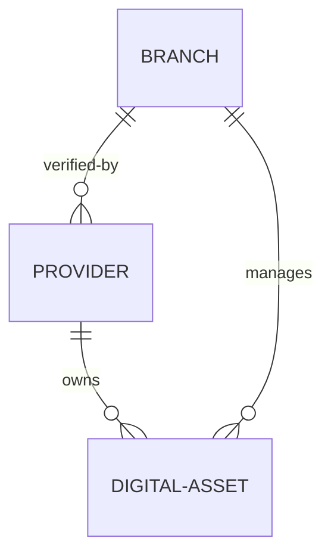

# ADR 003: Provider Inventory Ownership

> **This document represents the finalized Version 1 architecture. Any new feature outside Version 1 must be documented under `12-future-roadmap.md` before implementation.**

* **Title**: ADR 003: Provider Inventory Ownership
* **Status**: Approved
* **Date**: 2026-06-29

---

## Context

We need to establish how digital display assets (inventory) map to Providers and Branches when a single Provider owns screens located in different geographical districts.

---

## Decision

We will implement the following relational mapping strategy:

* **Single Provider Account**: A Provider remains a single company/entity within the system, regardless of how many districts they own inventory in.
* **Direct Inventory Ownership**: Each digital screen asset belongs to exactly one Provider.
* **Single-Branch Assignment**: Every individual screen asset is managed by exactly one SODARS Branch.
* **Flexible Branch Assignment**: If regional operational boundaries are adjusted, the responsibility of managing a specific screen can change from one SODARS Branch to another without altering the Provider's ownership of the asset.

---

## Consequences

* **Advantages**:
  * Simpler database relationships: No complex many-to-many lookup tables needed between screens, providers, and branches. A screen has a standard `provider_id` foreign key and a standard `branch_id` foreign key.
  * Simple permissions: Providers see all their screens in their profile, while Branch Managers only see screens tagged with their branch ID.
  * Easy updates: Reassigning a screen to another branch requires updating only a single foreign key column (`branch_id`) on the asset table.
* **Disadvantages**:
  * If a provider has screens in two branches, their profile must be queryable across branch boundaries for payout aggregation.

---

## Future Notes

* Support for custom regional coordinator roles under a single provider profile will be deferred to V2.
