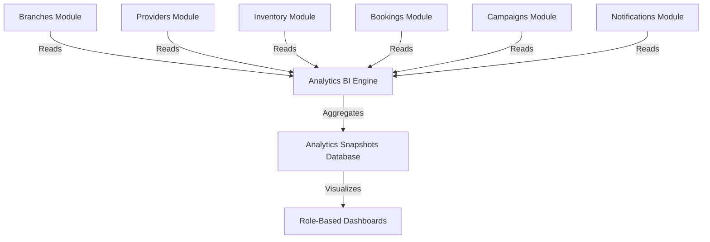

# Module: Analytics

> **This document represents the finalized Version 1 architecture. Any new feature outside Version 1 must be documented under `12-future-roadmap.md` before implementation.**

## Purpose

The purpose of this document is to introduce the Analytics module, which serves as the centralized, read-only Business Intelligence (BI) engine of SODARS, aggregating metrics across all modules.

---

## Scope

This document specifies:
* The read-only metrics aggregation philosophy.
* Role-based dashboard boundaries.
* Core analytical KPIs.

---

## Business Rules

### 1. Read-Only Aggregation Architecture
The Analytics module is strictly **read-only**. It:
* Must never write or update core transaction logs (e.g. altering bookings, changing user states, or modifying screen statuses).
* Consumes transaction data generated by other business modules to compute metrics:

---

### 2. Role-Based Dashboards
To protect corporate privacy and maintain data boundaries, dashboards are scoped by user role:

* **Executive Dashboard (Head Office/Super Admin)**:
  * Global consolidated financials (Gross bookings, platform fees, taxes).
  * System-wide display screen count and global average occupancy rates.
  * Performance rankings of branches and top providers.
* **Branch Dashboard (Branch Managers)**:
  * Local branch financials (branch bookings, branch markup commissions).
  * Regional screen counts, active provider logs, and branch occupancy percentages.
  * Local target execution trackers.
* **Provider Dashboard**:
  * Owned screen earnings breakdown (net payouts).
  * Occupancy calendar for their registered digital displays.
  * Payout reconciliation records.

---

## Future Scope

* **Power BI & Tableau Connectors**: Direct read-replica database integration pipelines for corporate external BI tools (deferred to V2).
