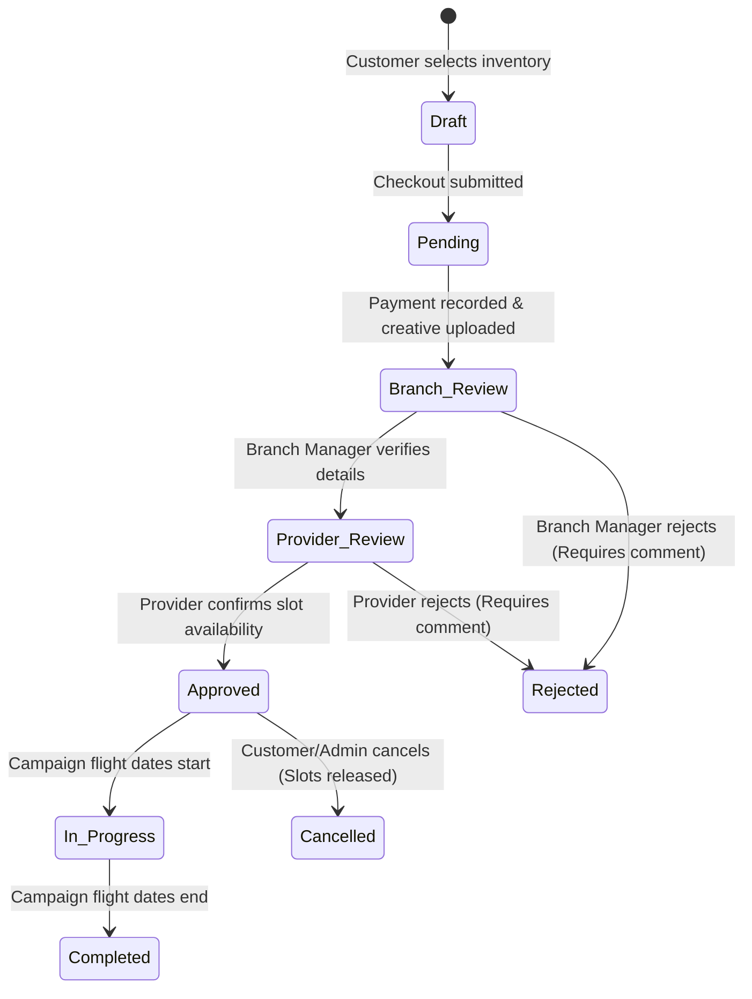

# Module: Bookings

> **This document represents the finalized Version 1 architecture. Any new feature outside Version 1 must be documented under `12-future-roadmap.md` before implementation.**

## Purpose

The purpose of this document is to introduce the Booking module, which serves as the core transaction processing system of SODARS, handling booking requests, manual payment logging, approvals, and campaign triggers.

---

## Scope

This document specifies:
* Booking lifecycle and status tracking.
* The multi-stakeholder approval flow (Customer -> Branch -> Provider).
* Structural relationships with display inventories and final active campaigns.

---

## Business Rules

### 1. Booking Status Lifecycle
Bookings flow through the following states in Version 1:

---

### 2. Approval Workflow
To accommodate physical verification constraints, Version 1 does not offer instant checkout. Bookings must traverse the following gates:

1. **Submission**: The Customer checks out items from their cart, uploads target creative banners, and enters their offline payment reference (e.g. Bank Transfer number). Status is set to `Pending`.
2. **Branch Verification**: The assigned Branch Manager verifies the receipt of payments (cash, bank ledger, or cheque clearance) and reviews the uploaded creative asset.
   * If correct, the manager transitions status to `Provider_Review`.
3. **Provider Confirmation**: The Provider logs in and confirms that the physical screen hardware is operating and the loop calendar can accommodate the booking schedule.
   * Clicking **Confirm Availability** changes the status to `Approved`.
4. **Campaign Generation**: The system automatically generates an active Campaign record upon status transitioning to `Approved`.

---

## Future Scope

* **Instant Online Approvals**: Automation engine validating payment gate API states and autolocking loop slots on digital screen players instantly (deferred to V2).
