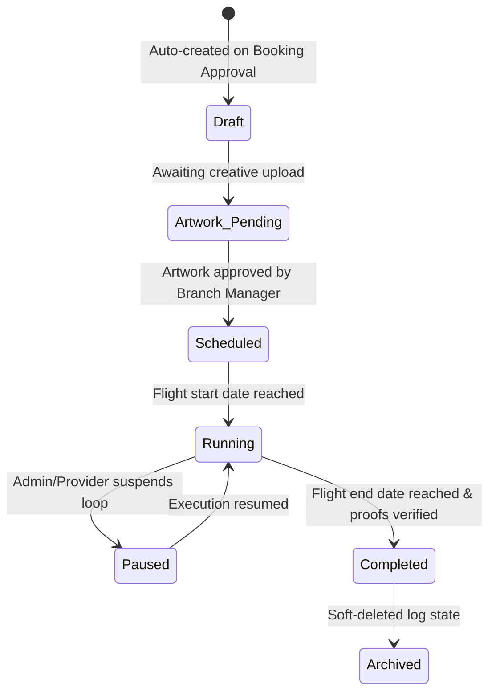

# Module: Campaigns

> **This document represents the finalized Version 1 architecture. Any new feature outside Version 1 must be documented under `12-future-roadmap.md` before implementation.**

## Purpose

The purpose of this document is to introduce the Campaign module, which handles the operational execution of advertisements, calendar schedules, creative assets auditing, and proof-of-performance uploads.

---

## Scope

This document specifies:
* The operational scope of Campaigns.
* Campaign lifecycle status mapping.
* Direct relationships with Bookings, display inventories, Providers, and regional Branches.

---

## Business Rules

### 1. Operational Separation of Responsibilities
* **Bookings**: Represent the **commercial transaction** (prices, markups, taxes, payment records).
* **Campaigns**: Represent the **operational execution** (ad slots, calendar maps, artwork uploads, verification proofs).
* **Dependency Constraint**: A Campaign cannot exist without an Approved Booking. Once a booking is marked `Approved`, the system auto-generates the corresponding campaign records.

---

### 2. Campaign Lifecycle States
Campaigns progress through the following statuses in Version 1:

---

### 3. Relationships Mapping
* **Booking**: Mapped to a single `booking_id`. If a booking is cancelled, its corresponding campaign is cancelled and archived.
* **Inventory**: Mapped to target digital/static display screens, registering exactly which play loop index slot is allocated to which creative banner.
* **Provider**: Providers download creative artwork assets from campaigns, broadcast them on physical screens, and upload photo/video proofs.
* **Branch**: Branch Managers review creative assets for policy compliance before campaigns are permitted to start running.

---

## Future Scope

* **API Signage Player Integrations**: Automatically exporting playlist schedules to media players, bypassing manual provider operations (deferred to V2).
