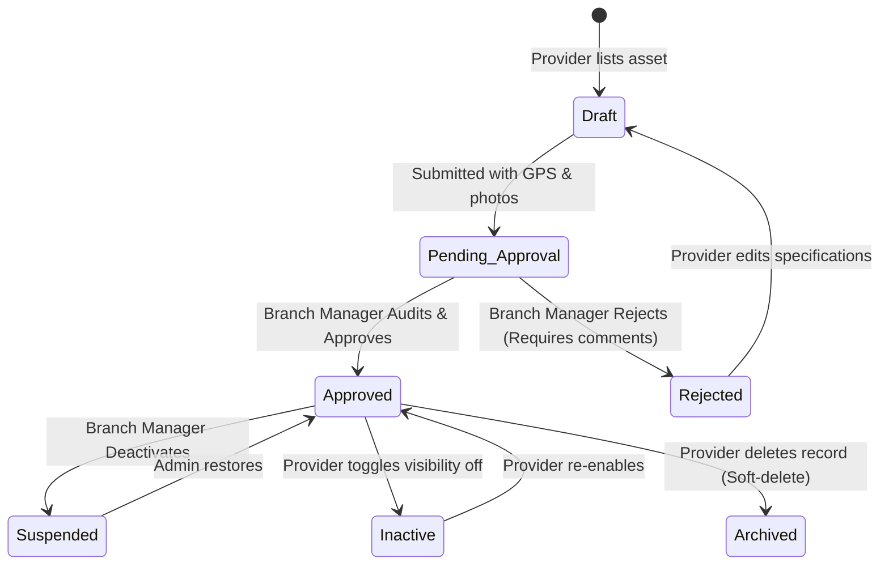

# Module: Inventory

> **This document represents the finalized Version 1 architecture. Any new feature outside Version 1 must be documented under `12-future-roadmap.md` before implementation.**

## Purpose

The purpose of this document is to introduce the Inventory module, which serves as the core database and operational hub for all advertising assets listed in the SODARS ecosystem.

---

## Scope

This document details:
* The business purpose of digital and static inventory.
* Functional inventory types for Version 1.
* Relationships between inventories and other key system layers (Providers, Branches, Campaigns, and the Marketplace).
* Standard asset status lifecycle.

---

## Business Rules

### 1. Inventory Types (Version 1)
SODARS is designed as a generic digital asset management platform. It is not built exclusively around digital billboards. The following physical asset classes must be supported:

* **Billboard**: Large, traditional, or backlit highway sign frameworks.
* **Hoarding**: Elevated regional signage boards.
* **LED Screen**: Live digital video displays capable of running multi-creative loop schedules.
* **Pole Kiosk**: Small roadside banner units mounted on utility/lamp poles.
* **Gantry**: Heavy steel structures spanning highways with overhead displays.
* **Bus Shelter**: Urban street furniture display panels.
* **Wall Branding**: Giant painted or vinyl graphics applied to building facades.
* **Transit Media**: Displays mounted on mobile public transport (buses, cabs).
* **Other**: A fallback category for non-standard formats (e.g., shopping mall standees).

---

### 2. Relational Workflows
* **Provider (Ownership)**:
  * Every inventory item belongs to exactly **one Provider**. This relationship is locked at listing creation and can never be modified.
* **Branch (Management)**:
  * Every inventory item is managed by exactly **one Branch** determined by the physical address city. The managing branch has the authority to approve, audit, and re-price the asset.
  * If boundaries change, the managing branch foreign key can be reassigned.
* **Marketplace Discovery**:
  * An asset is visible to public search only if its status is marked `Approved` and the `enable_marketplace` settings flag is enabled.
* **Campaign Booking**:
  * An asset is reserved for campaign flights. When booked, its scheduling calendar blocks off active loop slots for specific dates.

---

### 3. Inventory Status Lifecycle

---

## Future Scope

* **IoT Loop Syncing**: Directly synchronizing player logs from digital screens to compute real-time capacity and downtime.
