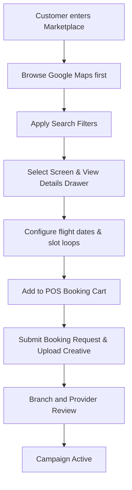

# Module: Marketplace

> **This document represents the finalized Version 1 architecture. Any new feature outside Version 1 must be documented under `12-future-roadmap.md` before implementation.**

## Purpose

The purpose of this document is to define the Marketplace module, which acts as the customer-facing e-commerce storefront for discovering and requesting digital/static outdoor advertising slots.

---

## Scope

This document specifies:
* Marketplace overview and user value propositions.
* The typical Customer Journey from search to checkout.
* Relationships between the marketplace, screen owners (Providers), and operational hubs (Branches).
* High-level campaign request flow.

---

## Business Rules

### 1. Customer Journey Flowchart
The following diagram illustrates the customer journey in Version 1:

### 2. Relational System Mapping
* **The Marketplace Agency Role**: The marketplace does not own inventory. It acts as an aggregator connecting Customers (advertisers) with Providers (media owners).
* **Provider Relations**: Providers publish approved screens to the marketplace. Their specified Net Price is locked and hidden from customers.
* **Branch Relations**: Regional branches govern local marketplace assets. The branch manager audits local screen uploads, approves listings, and manages branch markup margins.
* **Booking Request Flow (V1)**:
  * Bookings do not offer instant auto-approvals in Version 1.
  * Checkout generates a **Booking Request**.
  * The Branch Manager reviews payments and compliance, and the Provider confirms slot availability prior to campaign activation.

---

## Future Scope

* **Instant Checkout**: Automated verification APIs bypassing manual branch audits for established digital display loops.
