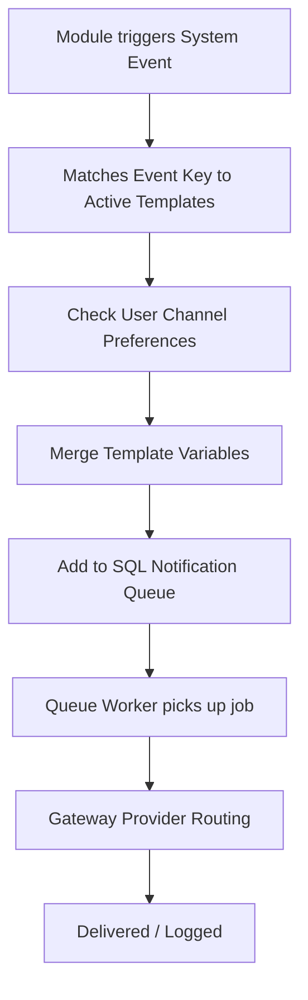

# Module: Notifications

> **This document represents the finalized Version 1 architecture. Any new feature outside Version 1 must be documented under `12-future-roadmap.md` before implementation.**

## Purpose

The purpose of this document is to introduce the Notifications module, which serves as the centralized event-driven communication router for the entire SODARS network.

---

## Scope

This document specifies:
* Centralized notifications architecture.
* Active dispatch channels for Version 1.
* Relationships with other business modules.
* Notification status lifecycle.

---

## Business Rules

### 1. Centralized Event-Driven Architecture
To prevent code duplication, individual modules (Branch, Provider, Bookings) must not write their own SMTP or SMS API routing wrappers. 

Instead, they register system events. The Notification Module listens for these events, merges variable data with predefined layouts, queues them, and dispatches them across correct channels:

---

### 2. Notification Channels (Version 1)
The following communication channels are supported:
* **Email**: Rich HTML transactional messages (SendGrid/Mailgun SMTP routing).
* **SMS**: Short alert texts (Twilio or local carrier SMS gateways).
* **WhatsApp**: Customer alerts and confirmations (WhatsApp Business API integration).
* **Push Notification**: Mobile smartphone prompts (Firebase Cloud Messaging).
* **In-App Notification**: Dashboard banner/alert feeds.
* **System Announcement**: Broadcast banner shown globally to all users.

---

### 3. Relationship with Other Modules
* **Branch**: Dispatches regional verification warnings and branch manager alerts.
* **Provider**: Sends screen listings approval alerts and payout notifications.
* **Customer**: Dispatches invoices, checkout confirmations, and creative warning notices.
* **Bookings**: Triggers transactional billing alerts.
* **Campaigns**: Dispatches creative compliance checks and scheduling calendars.

---

## Future Scope

* External integrations with Slack, Discord, Microsoft Teams, and Telegram APIs (deferred to V2).
