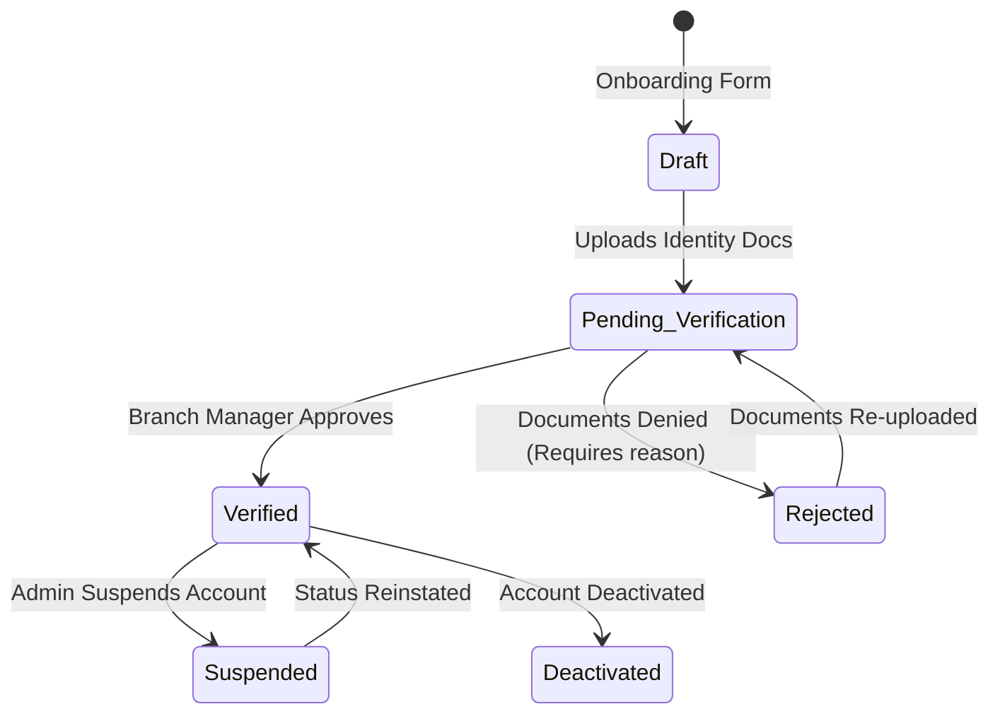

# Module: Providers

> **This document represents the finalized Version 1 architecture. Any new feature outside Version 1 must be documented under `12-future-roadmap.md` before implementation.**

## Purpose

The purpose of this module is to define the Provider dashboard ecosystem, governing display owners who list digital screens on the platform and configure their Net Price parameters.

---

## Scope

This module covers:
* High-level Provider definitions and roles.
* System relationships (with Branches, Inventory, and the Marketplace).
* Account subscription tier logic for display listing limits.
* Provider state lifecycle.

---

## Business Rules

### 1. Provider Overview & Responsibilities
* **Definition**: Providers are independent businesses, media owners, or screen operators who subscribe to SODARS to monetize their outdoor digital displays.
* **Core Responsibilities**:
  * Onboard their company profile and verify identity/tax credentials.
  * Supply precise GPS locations and hardware specifications for display assets.
  * Define locked **Net Prices** for screen bookings.
  * Maintain physical screen uptime and loop schedules.
  * Download customer ad creatives to load onto digital displays.

---

### 2. Relationship Mapping
* **Branch Alignment (Default Branch)**:
  * During onboarding, a Provider is mapped to exactly **one default Branch** (the branch governing their corporate registry city). This branch is responsible for verifying their documents and handling financial payouts.
* **Inventory Alignment (Managing Branch)**:
  * A Provider can own digital displays in various regional districts. Each display is mapped to the specific Branch governing that district. Thus, a single Provider's inventory can span different managing branches.
* **Marketplace Link**:
  * Providers list screens to the public marketplace. Participation is optional; providers can toggle their marketplace display state globally or per screen.

---

### 3. Provider Lifecycle States

* **Draft**: Profile is incomplete, missing core data/documents.
* **Pending Verification**: Account documents are uploaded and awaiting branch manager audit.
* **Verified**: Full access. Screen listings can go live.
* **Suspended**: Temporary restriction (e.g., due to payment dispute or layout non-compliance). Listings hidden.
* **Deactivated**: Soft-deleted status. System logins disabled.

---

### 4. Subscription Concept
* In Version 1, Providers select a Subscription Tier to define listing capacity:
  * *Free Tier*: List up to 2 active screens.
  * *Standard Tier*: List up to 20 active screens.
  * *Unlimited Tier*: List unlimited screens.
* Accounts must maintain an active subscription status. If a subscription expires, active listings exceeding the free tier limit are automatically set to `Inactive`.

---

## Future Scope

* **Automatic Subscription Upgrades**: Auto-invoicing integrations when listing counts grow.
* **Sub-Contractor Assignments**: Direct loops allowing third-party agencies to manage specific provider screen nodes.
