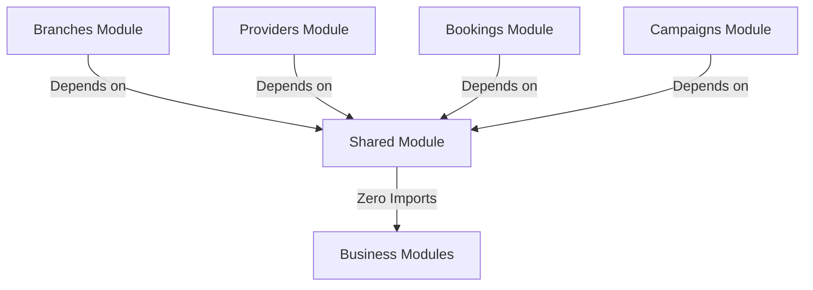

# Module: Shared

> **This document represents the finalized Version 1 architecture. Any new feature outside Version 1 must be documented under `12-future-roadmap.md` before implementation.**

## Purpose

The purpose of this document is to introduce the Shared module, which serves as the foundational infrastructure layer containing helpers, file upload utilities, geographic master tables, and geocoding integrations.

---

## Scope

This document specifies:
* The common shared utility scope.
* Rigid architectural dependency rules.
* Monorepo directories mapping.
* Naming and file conventions.

---

## Business Rules

### 1. Architectural Integrity & Dependency Rules
* **No Business Logic**: The Shared module must never contain rules, formulas, checks, or routes specific to business products (e.g. branch structures, markup pricing bounds, campaign approvals).
* **Strict Monidirectional Dependencies**:
  * Any functional module can import code from Shared.
  * Shared must **never** import classes, configs, models, or types from other business modules.

---

### 2. Centralized Services (Infrastructure Base)
The Shared module provides:
* **Common Upload Manager**: S3 API wrapper processing file metadata and uploads.
* **Google Maps Services**: Unified location tools executing latitude/longitude geocoding and routing calculations.
* **Master Geographies**: The fixed database schema mapping Countries, States, Districts, Cities, and Pin codes.
* **System Logging Utilities**: Append-only activity logs and system audit triggers.
* **Formatting Helpers**: Standard functions parsing dates, numbers, and currencies.

---

## Future Scope

* **Elasticsearch Engine Integrations**: Common vector search wrappers for search discovery maps (deferred to V2).
